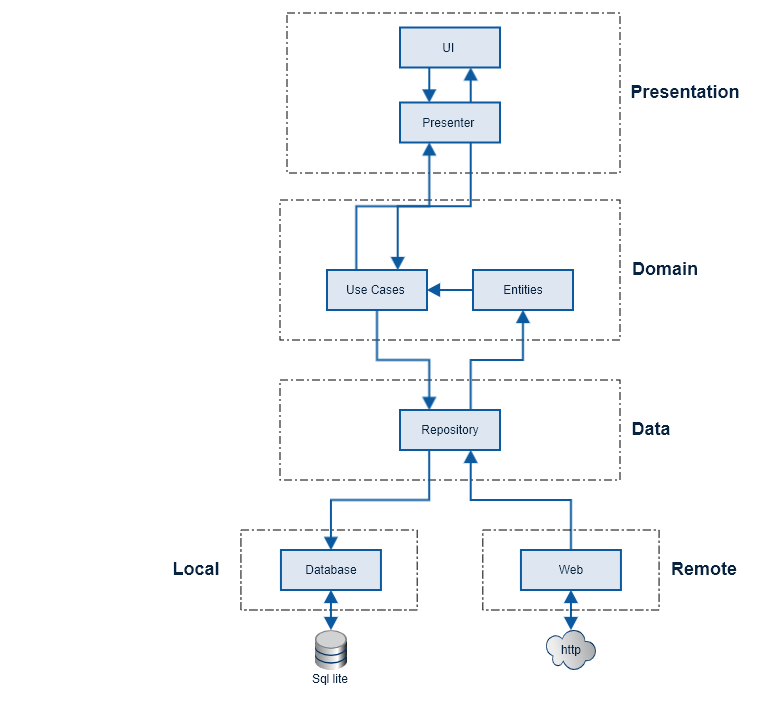

# Delivery App
## About
As a user I want to be able to see a list of my deliveries, including the receiver's photo and the item description. I also want to be able to see the delivery details when I click on the delivery item.

## Architecture
App is built using clean architecture and mvvm design pattern.

 

Modules used are as described below
* **Presentation:** This module includes the UI, ViewModels and DI classes.
* **Domain:** This module contains all business models and use cases. 
    * Entities will be used by presentation layer to render data and perform actions according to business rules.
    * Use cases are interactors and stand for application-specific business rules of the software. This layer is isolated from changes to the database, common frameworks, and the UI. 
* **Data:** This module provides data from web/local to domain layer. It contains an abstract definition of the different data sources, and how they should be used. It is independent of database and http client implementations. 
* **Local:** This module contains implementation for providing data from local. It uses room for getting data from local db.
* **Remote:** This module contains implementation for providing data from http client. It uses retrofit as a source to fetch data from the web.

Along with the Clean Architecture approach, the following Android architecture components are also used:
* **Room:** Provides an abstraction layer over SQLite to allow for more robust database access while harnessing the full power of SQLite.
* **ViewModel:** Designed to store and manage UI related data in a life cycle conscious way
* **Live Data:** An observable data holder class that, unlike a regular observable, is life cycle aware, meaning it respects the lifecycle of other app components such as activities, fragments, and services
* **Paging Library:** Makes it easier to load data gradually and gracefully within RecyclerView.

Also the following technologies are used:
* **Kotlin:** A statically typed programming language for modern multi-platform applications. Google rates Kotlin a first-class language for writing Android apps.
* **Dagger 2:** A fully static, compile-time dependency injection framework for both Java and Android.
* **RxJava 2:**  Reactive Extensions for the Java Virtual Machine (JVM) – a library for composing asynchronous and event-based programs using observable sequences for the JVM.
* **Retrofit 2:** A type-safe HTTP client for Android and Java  

## Libraries Used
* Android Architecture Components -- for using MVVM 
* Android JetPack -- for androidx components
* Retrofit2 -- for Network api 
* OkHttp3 -- used along side retrofit to tune network call properties such as timeout
* Dagger2 -- for DI
* Glide -- for Image Loading
* Mockito -- mocking framework for testing
* Room -- for local DB
* RxJava2 -- for Reactive Programming
* Paging -- for pagination   
 